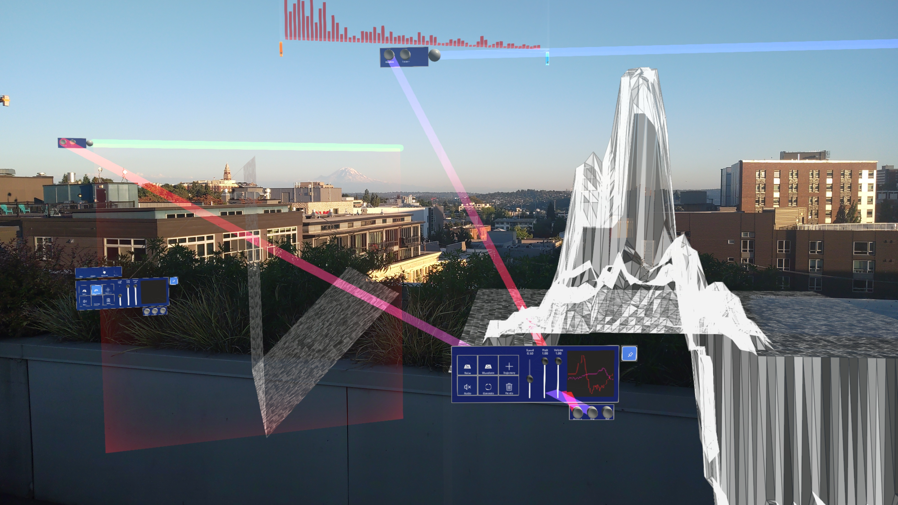

Wavelength is a Mixed Reality Musical Instrument (MRMI) comprised of malleable holographic objects, as polymorphic terrains, which performers reshape and orchestrate to create generative music.

What is a Mixed Reality Musical Instrument? [A Framework for the Design and Analysis of Mixed Reality Musical Instruments](https://nime.pubpub.org/pub/mrmi-framework/release/1)

<small>Font: [Perfect Waves](https://www.dafont.com/the-perfect-wave.font)</small>